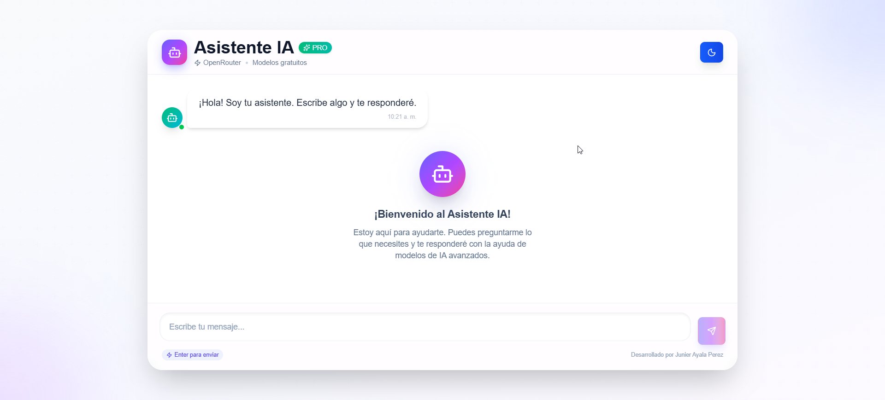
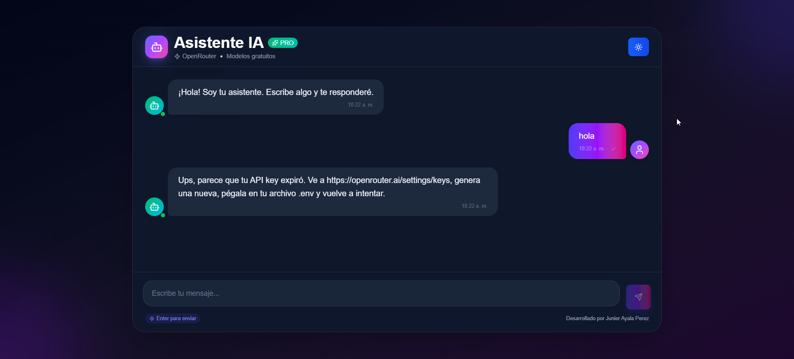
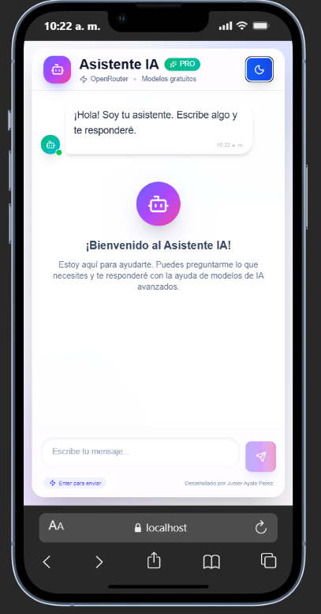
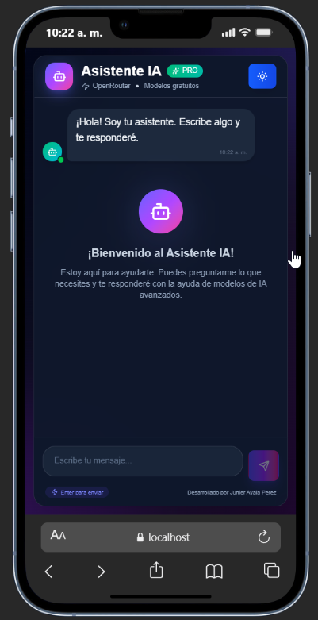

# Chat IA con OpenRouter

Pequeña aplicación de chat construida con **React + Vite + Tailwind CSS** que se conecta a **OpenRouter** para generar respuestas de IA.

Esta app incluye:

- Modo claro/oscuro con persistencia en `localStorage`.
- Indicador de “typing” mientras llega la respuesta.
- Manejo automático de modelos gratuitos (`:free`) y reintentos.
- Mensaje claro cuando la API key expira (401).
- UI moderna y responsive (móvil/desktop).

---

## 📸 Capturas de pantalla

### Modo (desktop)




### movil




## ⚙️ Configuración inicial

### 1) Instalar dependencias

```bash
npm install
```

### 2) Configurar la API Key (requerido)

Crea un archivo `.env` en la raíz con tu clave de OpenRouter:

```env
VITE_OPEN_ROUTER_IA_API_KEY=tu_api_key_aqui
```

> Si la API key expira, la app mostrará un mensaje indicando que debes regenerarla en:
> `https://openrouter.ai/settings/keys`

### 3) Ejecutar en modo desarrollo

```bash
npm run dev
```

### 4) Construir para producción

```bash
npm run build
```

---

## Estructura del proyecto

```
src/
├── assets/              # Imágenes, fuentes y recursos estáticos
├── components/
│   ├── shared/          # Componentes reutilizables propios (ConfirmDialog, Loader…)
│   └── ui/              # Componentes shadcn/ui (Button, Card, Input, Select…)
├── hooks/               # Custom hooks de React
├── lib/
│   ├── utils.ts         # Utilidad cn() para clases condicionales con Tailwind
│   └── use-media-query.ts  # Hooks para media queries, touch y DPR
├── services/            # Lógica de llamadas a APIs externas
├── types/               # Tipos e interfaces TypeScript globales
├── App.tsx              # Componente raíz
├── main.tsx             # Punto de entrada
└── index.css            # Estilos globales y variables CSS (design tokens)
```

---

## Inicio rápido

```bash
# 1. Instalar dependencias
npm install

# 2. Arrancar el servidor de desarrollo
npm run dev

# 3. Compilar para producción
npm run build

# 4. Previsualizar la build
npm run preview
```

---

## Scripts disponibles

| Comando                | Descripción                                         |
| ---------------------- | --------------------------------------------------- |
| `npm run dev`          | Servidor de desarrollo con HMR                      |
| `npm run build`        | Compila TypeScript y genera la build de producción  |
| `npm run preview`      | Sirve la build de producción localmente             |
| `npm run lint`         | Analiza el código con ESLint                        |
| `npm run format`       | Formatea todos los archivos con Prettier            |
| `npm run format:check` | Verifica que el código cumple el estilo de Prettier |

---

## Componentes UI (shadcn/ui)

Los componentes se encuentran en `src/components/ui/` y son totalmente editables. Se añaden con:

```bash
npx shadcn add <nombre-del-componente>
```

Componentes incluidos actualmente: `alert-dialog`, `badge`, `button`, `card`, `checkbox`, `drawer`, `input`, `input-group`, `label`, `select`, `sonner`, `textarea`.

La utilidad `cn()` de `src/lib/utils.ts` combina `clsx` y `tailwind-merge` para aplicar clases condicionales sin conflictos:

```ts
import { cn } from "@/lib/utils";

<div className={cn("rounded-lg p-4", isActive && "bg-primary text-white")} />
```

---

## Iconos

Los iconos provienen de **[Lucide](https://lucide.dev/icons/)**, una librería open-source con más de 1500 iconos SVG optimizados.

Puedes buscar y explorar todos los iconos disponibles aquí:
**[https://lucide.dev/icons/](https://lucide.dev/icons/)**

### Instalación

Ya incluido como dependencia del proyecto (`lucide-react`). No requiere instalación adicional.

### Uso básico

Importa el icono por su nombre en PascalCase directamente desde `lucide-react`:

```tsx
import { House, Search, Settings, Bell, ChevronRight } from "lucide-react";

export function MyComponent() {
  return (
    <div>
      <House />
      <Search />
    </div>
  );
}
```

### Personalización

Todos los iconos aceptan las mismas props:

```tsx
import { Star } from "lucide-react";

<Star
  size={24} // Tamaño en px (por defecto: 24)
  color="currentColor" // Color (por defecto: hereda del texto)
  strokeWidth={1.5} // Grosor del trazo (por defecto: 2)
  className="text-yellow-400 transition-transform hover:scale-110"
/>;
```

### Con Tailwind CSS

La forma más común es controlar el tamaño con `h-*` / `w-*` de Tailwind:

```tsx
import { Plus, Trash2, ArrowLeft } from "lucide-react";

// Tamaño con clases de Tailwind
<Plus className="h-4 w-4" />
<Trash2 className="h-5 w-5 text-red-500" />
<ArrowLeft className="h-6 w-6 text-muted-foreground" />
```

### Dentro de botones

```tsx
import { Download, Loader2 } from "lucide-react";
import { Button } from "@/components/ui/button";

<Button>
  <Download className="mr-2 h-4 w-4" />
  Descargar
</Button>;

{
  /* Icono de carga animado */
}
<Button disabled>
  <Loader2 className="mr-2 h-4 w-4 animate-spin" />
  Cargando...
</Button>;
```

---

## Notificaciones (Sonner)

```tsx
import { toast } from "sonner";

toast("Operación completada");
toast.success("Guardado correctamente");
toast.error("Ha ocurrido un error");
toast.loading("Procesando...");
```

---

## Calidad de código

### ESLint

Configurado en `eslint.config.js` con soporte para TypeScript, React Hooks y React Refresh. Ejecutar:

```bash
npm run lint
```

### Prettier

Configurado en `prettier.config.cjs`. Formatea automáticamente al guardar en VS Code (requiere la extensión [Prettier - Code formatter](https://marketplace.visualstudio.com/items?itemName=esbenp.prettier-vscode)):

```bash
npm run format        # Formatea todos los archivos
npm run format:check  # Solo verifica sin modificar
```

---

## Fuente tipográfica

Se usa **Geist Variable** de `@fontsource-variable/geist`, importada en `index.css`. Es la misma fuente utilizada por Vercel/Next.js.

---
